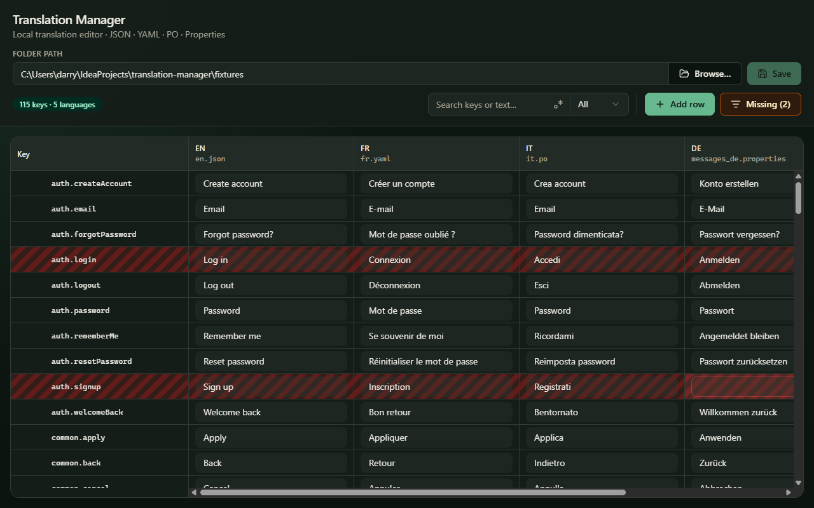
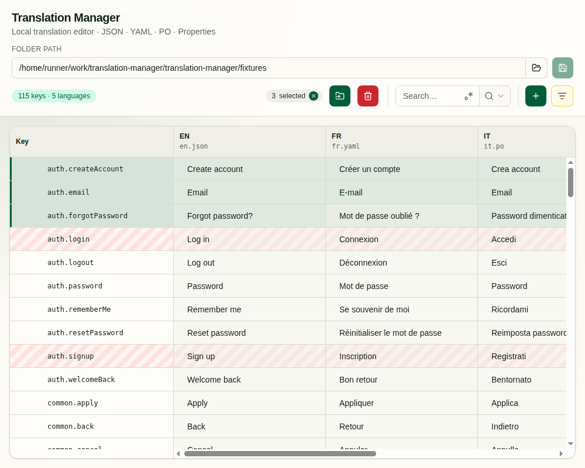

# Translation Manager

[](https://github.com/praetore/translation-manager/actions/workflows/ci.yml)
[](https://github.com/praetore/translation-manager/actions/workflows/release.yml)

A local desktop translation editor for software projects. Open a folder of locale files, edit keys and translations in a fast grid, and save changes back to disk — entirely offline, with no cloud or AI runtime.

|                                  Wide toolbar (dark mode)                                  |                                                    Compact toolbar + selection (light mode)                                                    |
|:---------------------------------------------------------------------------------------:|:-------------------------------------------------------------------------------------------------------------------------------------------:|
|  |  |

## Features

- **Local folder workflow** — open a locales directory via path or **Browse…**
- **Multiple formats in one project** — JSON, YAML (`.yaml` / `.yml`), gettext PO (`.po`), and Java `.properties`
- **Virtualized grid** — smooth scrolling for large key sets; one column per detected locale file
- **Search** — filter by keys and/or text, with optional regex and scope (all / keys / text)
- **Missing translations** — empty targets are highlighted when the source locale has a value; **Missing (N)** focuses on incomplete rows (snapshot stays stable until you toggle the filter again)
- **Inline editing** — edit keys and cells in place; unsaved work is tracked until you save
- **Rows & bulk actions** — add rows, multi-select, move keys to a new path prefix, or delete
- **Responsive toolbar** — full labels when there is room; icon-only with tooltips when the window is narrow
- **Themes & UI language** — light / dark / system; app UI in English or Dutch
- **100% local** — filesystem access stays in Electron’s main process via IPC; no network calls for translation

---

## For users

### Install

Download the latest build from [GitHub Releases](https://github.com/praetore/translation-manager/releases):

| Platform | Artifact |
|----------|----------|
| Windows | `Translation Manager-*-Setup.exe` (installer) or `*-Portable.exe` |
| macOS | `Translation Manager-*-{x64\|arm64}.dmg` (unsigned in CI) |
| Linux | `Translation Manager-*.AppImage` |

### How to use

1. Open the app
2. Enter a folder path that contains translation files, or click **Browse…**
3. Press **Enter** in the path field (or open via **File → Open…**) to load the project
4. Edit cells and keys inline
5. Click **Save** when you want changes written back to disk
6. Optional:
   - Use **search** (and regex / scope) to narrow the grid
   - Click **Missing (N)** to focus on incomplete rows
   - Select rows for **Move** / **Delete**, or use **Add row** for a new key

Locale codes are inferred from filenames (`en.json`, `messages_de.properties`, `fr.yaml`, `it.po`, …). The source locale defaults to `en` when present.

### Try sample data

The repo’s [`fixtures/`](fixtures/) folder is a ready-made multi-format set (EN, NL, FR, DE, IT) — the screenshots above use it. Point the app at that folder after cloning, or copy it somewhere convenient.

---

## For developers

### Requirements

- Node.js 20+ (22 recommended)
- npm

### Quick start

```bash
npm install
npm run dev
```

This starts Vite and launches the Electron window.

### Scripts

| Command | Description |
|---------|-------------|
| `npm run dev` | Dev server + Electron |
| `npm run build` | Typecheck + production build |
| `npm test` | Unit tests (Vitest) |
| `npm run test:e2e` | Electron smoke tests (Playwright; requires `npm run build`) |
| `npm run lint:all` | ESLint + file-length checks |
| `npm run dist` | Build + package for the current OS |
| `npm run dist:win` / `dist:mac` / `dist:linux` | Platform-specific packages |
| `npm run screenshots` | Capture README screenshots into `docs/` (after `npm run build`) |
| `npm run screenshots:local` | Same capture into gitignored `tmp/screenshots/` |
| `npm run icons` | Regenerate `build/icon.ico` / favicons from `build/icon.png` |
| `npm run preview` | Preview Vite production build |

Packaged artifacts land in `release/`.

### Architecture

```
electron/          Main process + preload (filesystem & dialogs via IPC)
src/               React renderer (UI only)
shared/            Shared types, locale helpers, format adapters
fixtures/          Sample translation files for local testing
```

| Process | Responsibility |
|---------|----------------|
| Main | `dialog`, `fs` read/write, directory scan |
| Preload | `contextBridge` API (`window.electronAPI`) |
| Renderer | UI, adapters, in-memory project state |

**Adapters** — each format implements `parse(content) → flat key/value map` and `serialize(map) → file content`. Nested JSON/YAML is flattened with dot notation (e.g. `nav.home`) for the grid, then reconstituted on save.

**Tech stack** — Electron + Vite (`vite-plugin-electron`), React 19 + TypeScript, TanStack Table + `react-window`, Zustand, Tailwind CSS v4 + shadcn/ui, Motion, i18next, `js-yaml`.

### Releasing

Pushing a `v*` tag builds installers for Windows, macOS, and Linux and uploads them to a GitHub Release. CI runs **`npm test`** and **`npm run test:e2e`** first; packaging only starts if those pass. After a successful release, CI refreshes README screenshots and bumps `package.json` to the **next minor** on `master` (e.g. release `v0.4.0` → commit `0.5.0`).

```bash
# package.json should already be the version you want to release (e.g. 0.4.0)
git tag v0.4.0
git push origin v0.4.0
```

You can also run **Actions → Release → Run workflow** manually.

Local screenshots (after `npm run build`):

```bash
npm run screenshots                 # writes to docs/ (README assets)
npm run screenshots:local           # writes to tmp/screenshots/ (gitignored)
xvfb-run -a npm run screenshots     # Linux / CI-style headless
```

Dark capture: wide window with full toolbar labels.  
Light capture: narrower window (icon-only toolbar) with a multi-row selection so the selection badge and bulk actions are visible.

Ensure `package.json` → `repository.url` points at your GitHub repo.

---

## License

This project is licensed under the [MIT License](LICENSE).
